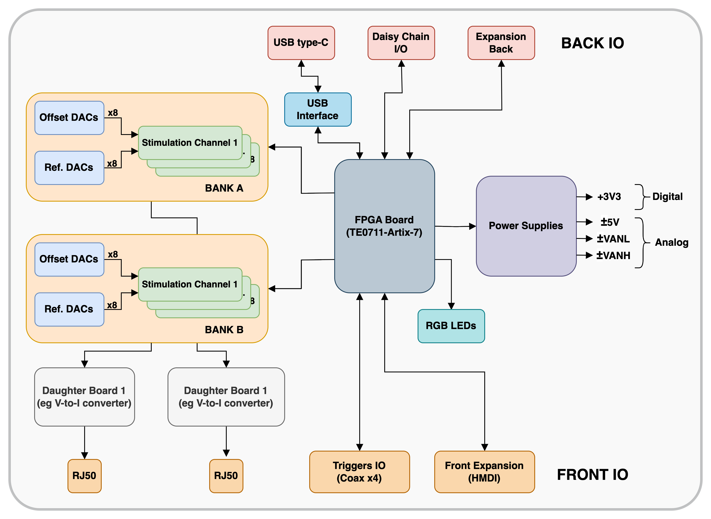

# Open-TWIST 🧠  
**An open-source and open-hardware benchtop neurostimulator offering precise, programmable, and arbitrary waveform generation for neuroscience research.**

## ⚠️ Disclaimer

This is an **ongoing research and development project**.  
open-TWIST is currently **experimental, untested, and subject to significant changes**.  

> ⚠️ **Warning:** This device is not certified for human.  
> It is intended **for research, prototyping, and educational purposes only**.  
> Use at your own risk and ensure proper electrical safety isolation at all times.

## 🧩 Presentation

**open-TWIST** aims to provide an **open-hardware, open-source benchtop neurostimulator** usable in **neural engineering research contexts**.  
It enables the generation of **multichannel neurostimulation patterns** with **arbitrary waveform shapes**, supporting a wide range of experimental paradigms.

**open-TWIST** continues the work initiated with **[TWIST](https://doi.org/10.3390/electronics10151867)**, a neurostimulator prototype developed by the *Bioelectronics Group* of the **IMS Laboratory (UMR CNRS 5218), INP Bordeaux, University of Bordeaux**.

Key features:
- **TODO**

## 🔧 Hardware

The hardware design of **open-TWIST** is fully open and available in the [**hardware**](./hardware/) directory.  
It includes:
- **Schematic** and **PCB layout** (KiCad format)  
- **Bill of Materials (BOM)** 
- **Detailed explanations of technical and design choices**

> **Status:** under development.  
> The schematic and PCB layout are approximately > **80%** and **30%** complete, respectively.

The overall system architecture of **open-TWIST** is shown below:

  

A complete technical description of each block can be found in the [**hardware directory**](./hardware/) of this repository.

## HDL 

**TODO**

## Software (Host)

**TODO**

## TODO List

### Hardware
- [ ] TODO
### HDL
- [ ] TODO

### Software
- [ ] TODO

## Changelog
All notable changes to this project will be documented in this file.

---

### [0.1.0] – October 2025
#### Added
- Initial commit  
- Repository structure created
- Added preliminary hardware schematic and global architecture diagram  
- Draft README

---

### [0.0.0] – Project Setup
#### Added
- Repository initialization  
